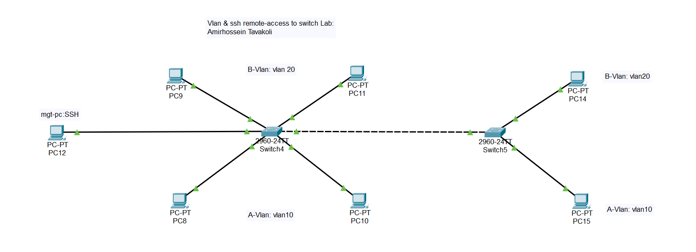

# VLAN + SSH Remote Access to Switch Lab

> **Author:** Amirhossein Tavakoli  
> **Tool:** Cisco Packet Tracer  
> **Level:** Intermediate  

---

## 📋 Overview

This lab demonstrates how to segment a network using VLANs and secure switch management access via SSH. Two Cisco 2960 switches are configured with VLAN 10 (A-Vlan) and VLAN 20 (B-Vlan), connected via a trunk link. A management PC accesses the switches remotely through SSH.

---

## 🖧 Topology



---

## 🎯 Objectives

- Configure VLAN 10 and VLAN 20 on two Cisco 2960 switches
- Assign access ports to the correct VLANs
- Configure trunk link between Switch4 and Switch5
- Enable SSH remote access for secure switch management
- Verify connectivity between same-VLAN devices
- Verify SSH login from management PC (mgt-pc)

---

## 🔧 Devices Used

| Device | Model | Role |
|--------|-------|------|
| Switch4 | Cisco 2960-24TT | Core Switch |
| Switch5 | Cisco 2960-24TT | Access Switch |
| PC8, PC10 | PC-PT | VLAN 10 (A-Vlan) |
| PC9, PC11 | PC-PT | VLAN 20 (B-Vlan) |
| PC14 | PC-PT | VLAN 20 (B-Vlan) |
| PC15 | PC-PT | VLAN 10 (A-Vlan) |
| PC12 | PC-PT | Management PC (SSH) |

---

## ⚙️ Key Configurations

### VLAN Setup
```bash
Switch(config)# vlan 10
Switch(config-vlan)# name A-Vlan
Switch(config)# vlan 20
Switch(config-vlan)# name B-Vlan
```

### Assign Access Ports
```bash
Switch(config)# interface fastEthernet 0/1
Switch(config-if)# switchport mode access
Switch(config-if)# switchport access vlan 10
```

### Trunk Link
```bash
Switch(config)# interface fastEthernet 0/24
Switch(config-if)# switchport mode trunk
```

### SSH Configuration
```bash
Switch(config)# hostname Switch4
Switch(config)# ip domain-name lab.local
Switch(config)# crypto key generate rsa
Switch(config)# username admin secret cisco123
Switch(config)# line vty 0 4
Switch(config-line)# transport input ssh
Switch(config-line)# login local
```

---

## ✅ Verification Commands

```bash
Switch# show vlan brief
Switch# show interfaces trunk
Switch# show ip ssh
Switch# show users
```

---

## 📁 Files

| File | Description |
|------|-------------|
| `vlan-ssh-lab.pkt` | Cisco Packet Tracer project file |
| `topology.png` | Network topology diagram |

---

## 📚 Concepts Covered

- VLAN segmentation
- Trunk ports (802.1Q)
- SSH remote management
- Switch security best practices

---

> 📘 Course reference: [Tosinso](https://tosinso.com) — CCNA Track
